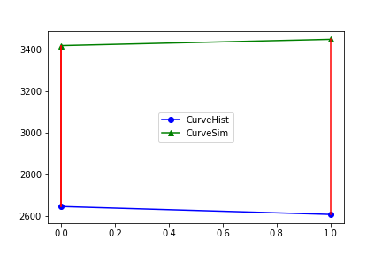
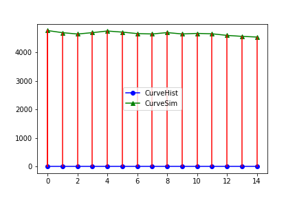
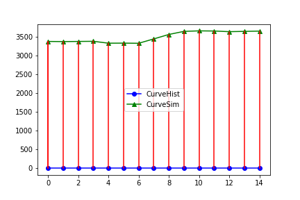
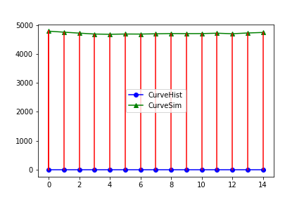

# CNNHM

The goal of CNNHM is to provide a package to automatically evaluate the simulation results from the petroleum simulation software instead of manually checking.

## The structure of the package

To fluently run the package, we suggest to organize the files in the following way. The frameworks and corresponding versions are also listed below.

```perl
├── setup.py
├── CNNHM.py
├── Readme.ipynb
├── training_dataset
│   └── modelA
│   └── modelB
├── validation_dataset
│   ├── GEC1PP99_202_WSWP.png
│   ├── GEC3PP95_202_WSWP.png
│   ├── GEC8PP95_202_WSWP.png
│   └── QAIKPP82_202_WSWP.png
└── saved_model
    ├── modelB_dbscan_100
    ├── modelB_gaussian_100
    └── modelB_kmeans_100
```

```python
tensorflow                2.0.0
pandas                    1.3.0
numpy                     1.20.3
```

The python package CNNHM can be reuse in any similar task. You can simply install the package by running the flowing command in your project

```python
python setup.py install
```

We would like to present the details of the package dependencies here.

```python
import os
from setuptools import setup

setup(
    name = "CNNHM",
    version = "1.0.0",
    author = "Liang Zhang",
    author_email = "liang.zhang@kaust.edu.sa",
    description = ("CNN based evaluator for resevior simulation of history matching"),

    python_requires='>=3',

    install_requires=[
        "tensorflow == 2.0.0",
        "pandas == 1.3.0",
        'numpy ==1.20.3',
    ],
)
```

## Import the package and setup a agent to do the history matching

- **dataset_path** → which dataset you would like to choose (modelA or modelB)
- **label_file** → which labelling method you would like to use (kmeans, gaussian, or dbscan)
- **geology_property** → what geology property you want to evaluate (WSWP, WWCT, WOPR, or WGPR)

```python
from CNNHM import CNN_HM
agent = CNN_HM(dataset_path="/ibex/scratch/zhanl0g/projects/AraIn/PetroleumHM/dataset/modelB",label_file="san_clusterred_modelB_kmeans_WSWP.csv", geology_property="WSWP")
```

## Train

- **epochs**→ the number of training epochs.
- **save_location**→ where to save the model (optional).

```python
agent.train(epochs=100,save_location="/ibex/scratch/zhanl0g/projects/AraIn/PetroleumHM/saved_model/modelB_kmeans_100") # if you want to save the model, input the location for saving models
```

## Predict

- **prediction_samples** → where you put the images you want to know the category they belong to (eg. type1 means overfitting, type 2 means well fitting, type 3 means under fitting, etc.).
- **load_model**→ if you already train and save the model, can directly load the model from this address, no need to train from the beginning (optional).

```python
agent.predict(**prediction_samples**="/ibex/scratch/zhanl0g/projects/AraIn/PetroleumHM/prediction_samples", load_model="/ibex/scratch/zhanl0g/projects/AraIn/PetroleumHM/saved_model/modelB_kmeans_100")
```

Output:

```python
Sample 1 QAIKPP82_202_WSWP.png
The prediction result: type 2
The result suppose to be: type 2

Sample 2 GEC3PP95_202_WSWP.png
The prediction result: type 3
The result suppose to be: type 3

Sample 3 GEC8PP95_202_WSWP.png
The prediction result: type 1
The result suppose to be: type 1

Sample 4 GEC1PP99_202_WSWP.png
The prediction result: type 1
The result suppose to be: type 1
```



Sample 1 QAIKPP82_202_WSWP.png
The prediction result: type 2
The result suppose to be: type 2



Sample 2 GEC3PP95_202_WSWP.png
The prediction result: type 3
The result suppose to be: type 3



Sample 3 GEC8PP95_202_WSWP.png
The prediction result: type 1
The result suppose to be: type 1



Sample 4 GEC1PP99_202_WSWP.png
The prediction result: type 1
The result suppose to be: type 1

## demo

```python
from CNNHM import CNN_HM
agent = CNN_HM(dataset_path="/Users/liangzhang/Desktop/liang/ibex/projects_ibex/AraIn/PetroleumHM/dataset/modelB",label_file="san_clusterred_modelB_kmeans_WSWP.csv", geology_property="WSWP")
agent.train(epochs=100,save_location="//Users/liangzhang/Desktop/liang/ibex/projects_ibex/AraIn/PetroleumHM/saved_model/modelB_kmeans_100") # if you want to save the model, input the location for saving models
agent.predict(prediction_samples="/Users/liangzhang/Desktop/liang/ibex/projects_ibex/AraIn/PetroleumHM/dataset/modelBprediction_samples", load_model="/Users/liangzhang/Desktop/liang/ibex/projects_ibex/AraIn/PetroleumHM/dataset/modelB/saved_model/modelB_kmeans_100")
```